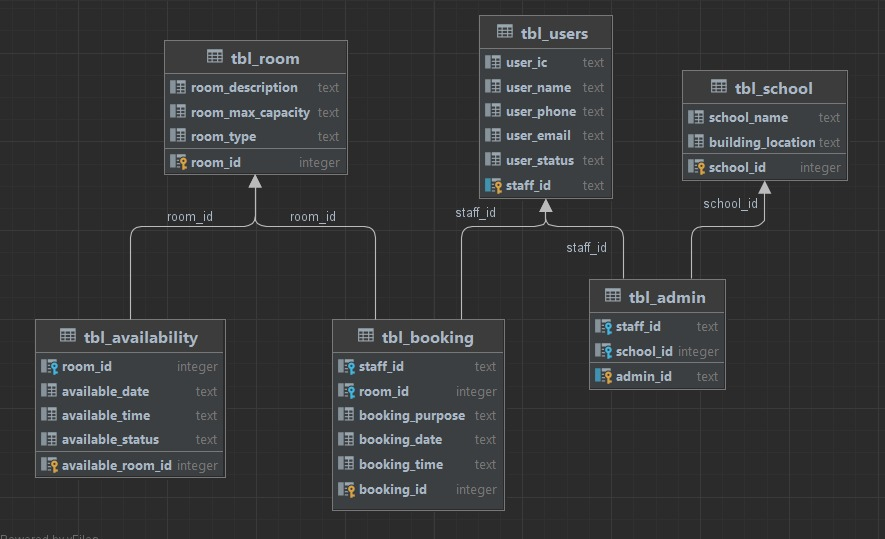

## Requirements for Group Project
[Read the instruction](https://github.com/STIW3054-A221/class-activity-soc/blob/main/GroupProject.md)

## Group Info:
| No. | Photo                                       | Name                  | Matric Number | Semester | Phone Number |
| ------------- |---------------------------------------------|-----------------------|---------------|----------|--------------|
|1.|  | Loh Siew Chin         | 278723        | 5        | 017-4918235  |
|2.|     | Teoh Zhi Yi           | 278645        | 5        | 018-2014036  |
|3.|   | Ooi Shi Koon          | 277290        | 5        | 017-5774491  |
|4.|      | Fanny Tang Tung Huong | 278366        | 5        | 011-51103470 |
|5.|   | Lim Zhun Wei          | 279632        | 5        | 014-7461218  |

## Title of your application
## Introduction
## Flow Diagram of the requirements

## User manual for installing your application on Heroku Server
## User manual/guideline for testing the system
## Result/Output (Screenshot of the output)
## Use Case Diagram

## UML Class Diagram
## Database Design
 
## Youtube Presentation
## References (Not less than 20)
## JavaDoc
